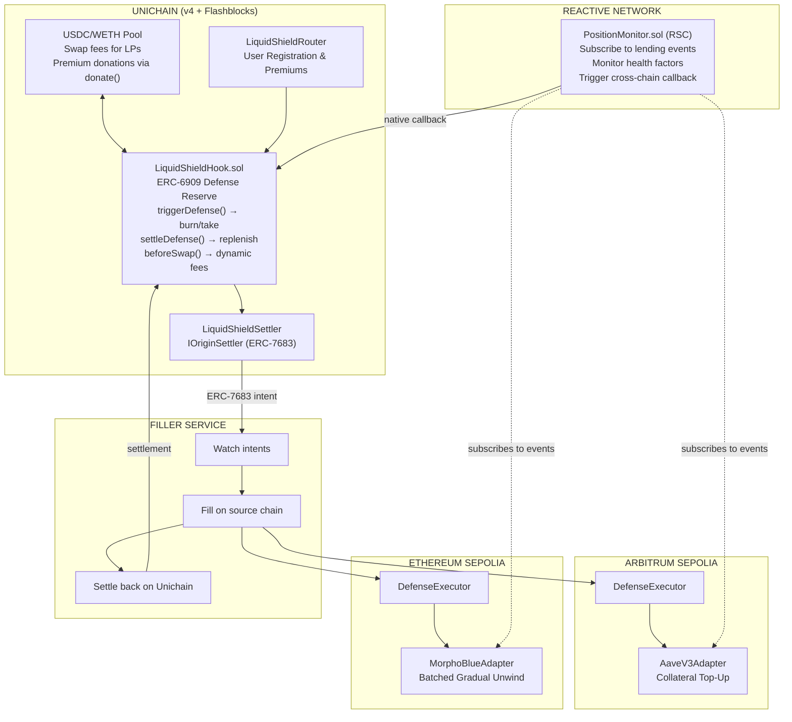
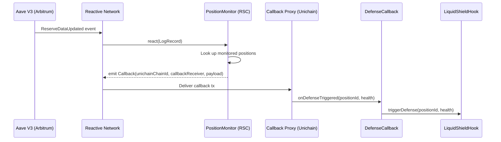

# LiquidShield — Cross-Chain Liquidation Defense Hook

> **Uniswap v4 Hook | Unichain | Reactive Network**
> **UHI8 Hookathon | March 2026**

> [!IMPORTANT]
> **[Watch the Demo Video](LOOM_LINK_HERE)** (under 5 minutes)

**Never get liquidated again.** LiquidShield is a Uniswap v4 hook that monitors DeFi lending positions across chains and executes preemptive defense strategies before liquidation occurs — turning Uniswap LPs into decentralized insurance providers.

---

## Key Features

- **Cross-Chain Defense**: Monitors positions on Aave (Arbitrum) and Morpho (Ethereum) from Unichain
- **v4-Native Architecture**: ERC-6909 defense reserve with atomic burn/take/donate — every delta resolves to zero
- **Dual Adapter Pattern**: `AaveV3Adapter` (collateral top-up) + `MorphoBlueAdapter` (batched gradual unwind) — proving protocol-agnostic extensibility
- **Sub-Second Reaction**: Flashblocks (200ms preconfirmation) + TEE priority ordering = ~400ms detection-to-defense
- **Non-Custodial**: Approval-based delegation lets the executor act on behalf of user's EOA without custody (EIP-7702 production target)
- **Novel LP Yield**: "Liquidation insurance yield" = swap fees + protection premiums + defense execution fees

---

## The Problem

Over **$2B** in DeFi positions were liquidated in 2024. Users lost 5-15% in penalties to liquidation bots and MEV searchers. Current solutions are manual — watch your health factor, set price alerts, scramble to add collateral.

No automated, non-custodial defense layer exists that works across chains.

**LiquidShield changes this.** By embedding liquidation defense directly into a Uniswap v4 hook, we turn passive LP liquidity into active insurance infrastructure.

---

## Architecture Overview



---

## Package Structure

| Package | Purpose | Technology |
|---|---|---|
| [`packages/contracts`](./packages/contracts/) | Core hook, router, settler, adapters, RSC, executor | Solidity, Foundry, Uniswap v4 |
| [`packages/filler`](./packages/filler/) | Intent watching + cross-chain execution + settlement | TypeScript, Viem, ERC-7683 |
| [`packages/frontend`](./packages/frontend/) | Dashboard + landing page | Next.js 14, wagmi v2, TailwindCSS |
| [`packages/backend`](./packages/backend/) | Position aggregation, health monitoring, defense history | Hono, TypeScript, GraphQL |
| [`packages/shared`](./packages/shared/) | Types, constants, ABIs shared across packages | TypeScript |

---

## How It Works

### Phase 1: Pool Setup & LP Deposit

LPs deposit USDC and WETH into a standard Uniswap v4 pool on Unichain with the LiquidShield hook attached. They earn triple yield: swap fees + protection premiums + defense execution fees.

### Phase 2: Position Registration

Users register their lending positions (Aave or Morpho) by calling `registerAndPayPremium()` on the router. They pre-approve the DefenseExecutor to act on their behalf on the source chain. An upfront premium (paid in USDC) covers N months of protection.

### Phase 3: Cross-Chain Monitoring

Reactive Smart Contracts (RSCs) on Reactive Network subscribe to lending protocol events across Arbitrum and Ethereum. When a health factor drops below the user's configured threshold, the RSC triggers a callback to the hook on Unichain.

### Phase 4: Defense Execution

1. RSC callback hits `triggerDefense()` on the hook
2. Hook calls `poolManager.unlock()` — enters flash accounting context
3. Inside callback: `burn()` ERC-6909 claims (+delta) → `take()` tokens (-delta) → **deltas = 0** ✓
4. Hook calls Settler to emit `ERC-7683 GaslessCrossChainOrder` with extracted defense capital
5. Filler picks up intent, fills on source chain via `DefenseExecutor`
6. Lending adapter executes strategy (collateral top-up or batched gradual unwind)
7. Filler settles back on Unichain → hook reserve replenished, 1.5% fee charged

### Phase 5: LP Rewards

Hook periodically calls `poolManager.donate()` to distribute accumulated premiums and defense fees to in-range LPs — v4's native mechanism for LP reward distribution.

---

## Shared Liquidity Layer (Aqua0)

LiquidShield's hook inherits from `Aqua0BaseHook` — a shared liquidity layer we built that enables JIT (Just-In-Time) liquidity amplification. The hook operates two independent capital systems on the same pool: a **defense reserve** (ERC-6909 claims, funded by premiums and direct deposits) for liquidation protection, and **JIT shared liquidity** (from Aqua0's SharedLiquidityPool) for swap amplification. LPs earn yield from both systems.

| File | Description |
|---|---|
| [`packages/contracts/src/aqua0/Aqua0BaseHook.sol`](./packages/contracts/src/aqua0/Aqua0BaseHook.sol) | Base hook — `_addVirtualLiquidity()` in beforeSwap, `_removeVirtualLiquidity()` + `_settleVirtualLiquidityDeltas()` in afterSwap |
| [`packages/contracts/src/aqua0/SharedLiquidityPool.sol`](./packages/contracts/src/aqua0/SharedLiquidityPool.sol) | Shared capital pool — holds user deposits, tracks per-user PnL with exact fee isolation, settles swap deltas |

---

## Defense Strategies

| Strategy | Adapter | When Used | How It Works |
|---|---|---|---|
| **Collateral Top-Up** | `AaveV3Adapter` | Health factor approaching threshold | Hook extracts WETH from defense reserve → filler deposits as additional collateral on Aave → health factor recovers |
| **Batched Gradual Unwind** | `MorphoBlueAdapter` | Position in critical danger | Hook emits N sequential ERC-7683 intents, each for a fractional portion → filler executes each batch on source chain → position gracefully unwound without cascade liquidation |

---

## Partner Integrations

> This section maps each partner technology to the exact files where it's integrated.

### Uniswap v4 Hooks

Core hook leveraging v4's flash accounting, ERC-6909 claims, and `donate()` for LP distribution.

| File | Description |
|---|---|
| [`packages/contracts/src/hooks/LiquidShieldHook.sol`](./packages/contracts/src/hooks/LiquidShieldHook.sol) | Main hook contract — `getHookPermissions()`, `beforeSwap()`, `afterAddLiquidity()`, `afterRemoveLiquidity()`, defense trigger, ERC-6909 accounting |
| [`packages/contracts/src/router/LiquidShieldRouter.sol`](./packages/contracts/src/router/LiquidShieldRouter.sol) | User-facing registration and premium payments via the hook |
| [`packages/contracts/src/interfaces/ILiquidShieldHook.sol`](./packages/contracts/src/interfaces/ILiquidShieldHook.sol) | Hook interface definition |
| [`packages/contracts/test/LiquidShieldHook.t.sol`](./packages/contracts/test/LiquidShieldHook.t.sol) | 50 Foundry tests: registration, premium collection, defense trigger, ERC-6909 accounting, donate(), dynamic fees |
| [`packages/contracts/test/integration/FullDefenseFlow.t.sol`](./packages/contracts/test/integration/FullDefenseFlow.t.sol) | End-to-end integration: register → trigger → defend → settle → donate |

### Unichain (Flashblocks + TEE)

LiquidShield leverages Unichain's 200ms Flashblock preconfirmations for sub-second defense reaction time, and TEE-based priority ordering to prevent MEV front-running of defense transactions.

| File | Description |
|---|---|
| [`packages/contracts/src/hooks/LiquidShieldHook.sol`](./packages/contracts/src/hooks/LiquidShieldHook.sol) | Hook deployed on Unichain Sepolia — all defense accounting benefits from ~400ms state propagation via Flashblocks |
| [`packages/contracts/src/settler/LiquidShieldSettler.sol`](./packages/contracts/src/settler/LiquidShieldSettler.sol) | ERC-7683 settlement on Unichain — intent emission + filler settlement verification |
| [`packages/filler/src/watcher.ts`](./packages/filler/src/watcher.ts) | Monitors Flashblock-preconfirmed defense events for rapid filler response |
| [`packages/filler/src/settlement.ts`](./packages/filler/src/settlement.ts) | Settlement back on Unichain after source-chain defense execution |

### Reactive Network

Cross-chain health factor monitoring via Reactive Smart Contracts — the canonical RSC use case.

| File | Description |
|---|---|
| [`packages/contracts/src/rsc/PositionMonitor.sol`](./packages/contracts/src/rsc/PositionMonitor.sol) | RSC deployed on Reactive Network (Lasna testnet) — inherits `AbstractReactive` + `IReactive`, subscribes to lending protocol events via `service.subscribe()`, emits `Callback` events for cross-chain delivery |
| [`packages/contracts/src/rsc/DefenseCallback.sol`](./packages/contracts/src/rsc/DefenseCallback.sol) | Callback receiver on Unichain — inherits `AbstractCallback`, receives callbacks from Reactive callback proxy (`0x9299472A...FC4`), forwards `triggerDefense()` to hook |
| [`packages/contracts/test/PositionMonitor.t.sol`](./packages/contracts/test/PositionMonitor.t.sol) | 14 Foundry tests: subscription, `react(LogRecord)` with `vmOnly`, callback emission, multi-position support |



### ERC-7683 (Cross-Chain Intents)

| File | Description |
|---|---|
| [`packages/contracts/src/settler/LiquidShieldSettler.sol`](./packages/contracts/src/settler/LiquidShieldSettler.sol) | `IOriginSettler` implementation — `open()` emits `GaslessCrossChainOrder`, `settle()` verifies filler execution |
| [`packages/contracts/test/LiquidShieldSettler.t.sol`](./packages/contracts/test/LiquidShieldSettler.t.sol) | 16 tests: order creation, nonce tracking, settlement, authorization |
| [`packages/filler/src/watcher.ts`](./packages/filler/src/watcher.ts) | Intent watcher — monitors `OrderOpened` events, decodes intent data |
| [`packages/filler/src/executor.ts`](./packages/filler/src/executor.ts) | Filler executor — dispatches to strategy, fills on source chain |

### Defense Executor & Lending Adapters

| File | Description |
|---|---|
| [`packages/contracts/src/executor/DefenseExecutor.sol`](./packages/contracts/src/executor/DefenseExecutor.sol) | Source-chain executor — routes to correct `ILendingAdapter`, executes defense via user's pre-approval |
| [`packages/contracts/src/interfaces/ILendingAdapter.sol`](./packages/contracts/src/interfaces/ILendingAdapter.sol) | Protocol-agnostic interface — `getHealthFactor()`, `depositCollateral()`, `repayDebt()`, `getPositionData()` |
| [`packages/contracts/src/adapters/AaveV3Adapter.sol`](./packages/contracts/src/adapters/AaveV3Adapter.sol) | Aave V3 adapter — collateral top-up via `pool.supply()`, health factor via `getUserAccountData()` |
| [`packages/contracts/src/adapters/MorphoBlueAdapter.sol`](./packages/contracts/src/adapters/MorphoBlueAdapter.sol) | Morpho Blue adapter — computed HF from position data + oracle + LLTV, `supplyCollateral()` for defense |
| [`packages/contracts/test/adapters/`](./packages/contracts/test/adapters/) | Per-adapter test suites (9 Aave tests, 8 Morpho tests including fuzz) |

---

## Supported Networks

| Network | Chain ID | Role |
|---|---|---|
| **Unichain Sepolia** | 1301 | Hook deployment, pool, settlement |
| **Base Sepolia** | 84532 | Aave V3 positions + defense execution (source chain) |
| **Reactive Lasna** | 5318007 | RSC deployment for cross-chain monitoring |

> **Note:** MorphoBlueAdapter is included with 8 unit tests but is not deployed to a testnet — no Morpho Blue markets exist on supported Reactive Network testnets. Arbitrum Sepolia has executor + adapter deployed but is not monitored by the RSC (not supported by Reactive Network as origin chain).

---

## Deployed Contracts

> Testnet deployments for the hookathon demo.

| Contract | Network | Address |
|---|---|---|
| `LiquidShieldHook` | Unichain Sepolia | `0x008E3fDE34a243F1aa18CC0f381040063eCC95C0` |
| `LiquidShieldRouter` | Unichain Sepolia | `0xdf9aE57790c9c26AD5f0D986267216d9E8d8Cc9E` |
| `LiquidShieldSettler` | Unichain Sepolia | `0xF540054007966371d338D337d73A08A34649aB76` |
| `DefenseCallback` | Unichain Sepolia | `0x645d483fa6882B5f40e6c3d5B5bf9708DECe92f5` |
| `DefenseExecutor` | Base Sepolia | `0xf02cB2bC2121b7688EE87eE546D2f819ae1C2c67` |
| `AaveV3Adapter` | Base Sepolia | `0x1eB7638CAa7053833Ad9cd7E8276f3E3574AD106` |
| `PositionMonitor` (RSC) | Reactive Lasna | `0xf02cB2bC2121b7688EE87eE546D2f819ae1C2c67` |

---

## Quick Start

### Prerequisites

- [Foundry](https://book.getfoundry.sh/) (for contracts)
- Node.js 18+ and pnpm 8+
- Access to testnet faucets ([Unichain](https://faucet.unichain.org/), [Alchemy Sepolia](https://sepoliafaucet.com/))

### Installation

```bash
git clone https://github.com/0xYudhishthra/liquidshield.git
cd liquidshield

# Install contract dependencies
cd packages/contracts
forge install

# Install JS dependencies
cd ../..
pnpm install
```

### Run Tests

```bash
# Contract tests (150 tests)
cd packages/contracts
forge test -vvv

# Specific adapter tests
forge test --match-contract AaveV3AdapterTest -vvv
forge test --match-contract MorphoBlueAdapterTest -vvv

# Backend tests (285 tests)
cd ../backend && pnpm test

# Frontend tests (129 tests)
cd ../frontend && pnpm test

# Filler tests (23 tests)
cd ../filler && pnpm test
```

### Local Development

```bash
# Start backend API
cd packages/backend && pnpm dev

# Start frontend
cd packages/frontend && pnpm dev

# Start filler service
cd packages/filler && pnpm dev
```

### Environment Configuration

Copy `.env.example` to `.env` and fill in your values:

```bash
# RPC Endpoints
UNICHAIN_SEPOLIA_RPC_URL=https://sepolia.unichain.org
ARBITRUM_SEPOLIA_RPC_URL=https://sepolia-rollup.arbitrum.io/rpc
ETHEREUM_SEPOLIA_RPC_URL=https://rpc.sepolia.org
REACTIVE_KOPLI_RPC_URL=https://kopli-rpc.reactive.network

# Deployer
PRIVATE_KEY=0x...

# Frontend
NEXT_PUBLIC_HOOK_ADDRESS=
NEXT_PUBLIC_ROUTER_ADDRESS=
NEXT_PUBLIC_SETTLER_ADDRESS=
NEXT_PUBLIC_API_URL=http://localhost:3001

# Filler
FILLER_PRIVATE_KEY=0x...
```

---

## Testing

```bash
cd packages/contracts

# Full suite
forge test

# With gas reporting
forge test --gas-report

# Specific test files
forge test --match-contract LiquidShieldHookTest     # Core hook (50 tests)
forge test --match-contract PositionMonitorTest       # RSC monitoring (19 tests)
forge test --match-contract LiquidShieldSettlerTest   # ERC-7683 settlement (16 tests)
forge test --match-contract DefenseExecutorTest       # Source-chain executor (10 tests)
forge test --match-contract AaveV3AdapterTest         # Aave adapter (9 tests)
forge test --match-contract MorphoBlueAdapterTest     # Morpho adapter (8 tests)
forge test --match-contract LiquidShieldRouterTest    # Router (7 tests)
forge test --match-contract FullDefenseFlowTest       # End-to-end integration (7 tests)
```

### Test Coverage

| Test Suite | Tests | Description |
|---|---|---|
| `LiquidShieldHook.t.sol` | 52 | Registration, premium collection, defense trigger, ERC-6909 accounting, donate(), dynamic fees, Aqua0 JIT, fuzz testing |
| `ProtectionMechanism.t.sol` | 27 | Delta atomicity, dynamic fee scaling, reserve depletion, premium boundaries, multi-user concurrent defenses, full E2E, fuzz |
| `LiquidShieldSettler.t.sol` | 16 | Order creation, nonce tracking, settlement verification, authorization, fuzz testing |
| `PositionMonitor.t.sol` | 14 | RSC subscription with AbstractReactive, react(LogRecord), vmOnly, callback emission |
| `DefenseExecutor.t.sol` | 10 | Strategy dispatch, adapter routing, access control, fuzz testing |
| `AaveV3Adapter.t.sol` | 9 | Health factor reads, collateral deposit, debt repay, fuzz testing |
| `MorphoBlueAdapter.t.sol` | 8 | HF computation from position data + oracle + LLTV, collateral operations |
| `LiquidShieldRouter.t.sol` | 7 | User registration, premium payments, unregistration |
| `FullDefenseFlow.t.sol` | 7 | Full lifecycle: register → trigger → defend → settle → donate → unregister |
| **Total Solidity** | **150** | |
| Backend tests | 285 | API routes, position aggregation, defense store, webhooks |
| Frontend tests | 129 | Component tests, hook tests, utility tests |
| Filler tests | 23 | Watcher, executor, strategy tests |
| **Total** | **563** | |

---

## Demo Video

**[Watch on Loom](LOOM_LINK_HERE)** — under 5 minutes

The demo shows:
1. **Aave Defense** (Arbitrum): Register position → simulate price drop → collateral top-up → health factor recovered
2. **Morpho Defense** (Ethereum): Register position → simulate severe drop → batched gradual unwind → position gracefully unwound
3. **Architecture walkthrough**: v4 hook + RSC + ERC-7683 + adapter pattern

> One USDC/WETH pool. Two lending protocols. Two defense strategies. Two chains. Every delta resolves to zero.

---

## Bounty Alignment

### Uniswap Foundation ($20K pool)
- Novel hook combining liquidity management + risk management + dynamic fees
- ERC-6909 defense reserve demonstrates deep v4 flash accounting understanding
- `poolManager.donate()` for LP reward distribution — v4-native mechanism
- Dual adapter pattern proves hooks as composable infrastructure

### Unichain ($10K pool)
- Flashblocks: ~400ms detection-to-defense response time
- TEE: Priority ordering prevents MEV front-running of defense transactions
- ERC-7683: Native cross-chain intent settlement via `LiquidShieldSettler`
- All four Unichain capabilities used together — not forced, essential

### Reactive Network ($5K pool)
- Cross-chain health factor monitoring = THE canonical RSC use case
- RSC subscribes to lending protocol events across multiple chains
- Evaluates conditions → triggers cross-chain callback to hook
- `PositionMonitor.sol` with 19 dedicated tests

---

## Technical Decisions

**Why ERC-6909 defense reserve, not "draw from pool"?**
v4's flash accounting requires all deltas to resolve to zero within a single `unlock` callback. The hook can't `take()` tokens and send them cross-chain expecting repayment later — the transaction would revert. Instead, the hook accumulates defense capital as ERC-6909 claims (from premium revenue) and atomically burns/takes when defense triggers.

**Why `poolManager.donate()` for LP premiums?**
It's v4's native mechanism for distributing tokens to in-range LPs. No custom accounting needed. Premiums collected by the hook are periodically donated to the pool, flowing to LPs proportional to their liquidity.

**Why batched intents, not TWAMM, for gradual unwind?**
TWAMM is a pool-side swap mechanism. Defense unwind is a cross-chain operation (withdraw collateral → sell → repay). Each step requires a full ERC-7683 settlement cycle. The hook emits N sequential intents — Unichain-side accounting updates at Flashblock speed, but source chain execution is bound by its block time.

**Why USDC/WETH pool?**
Both assets serve as defense capital — WETH for WETH-collateralized positions, USDC for USDC-collateralized positions. No swap needed to deploy defense capital, reducing slippage and latency.

---

## License

This project is licensed under the [MIT License](./LICENSE).

## Links

- **Demo Video**: [Loom](LOOM_LINK_HERE)
- **Hookathon**: [UHI8 by Atrium Academy](https://atrium.academy/uniswap)
- **Uniswap v4 Docs**: [docs.uniswap.org](https://docs.uniswap.org/contracts/v4/overview)
- **Unichain Docs**: [docs.unichain.org](https://docs.unichain.org)
- **Reactive Network**: [reactive.network](https://reactive.network)

---

**Built for the UHI8 Hookathon by [Yudhishthra](https://github.com/0xYudhishthra)**

*Turning passive liquidity into active insurance infrastructure.*
