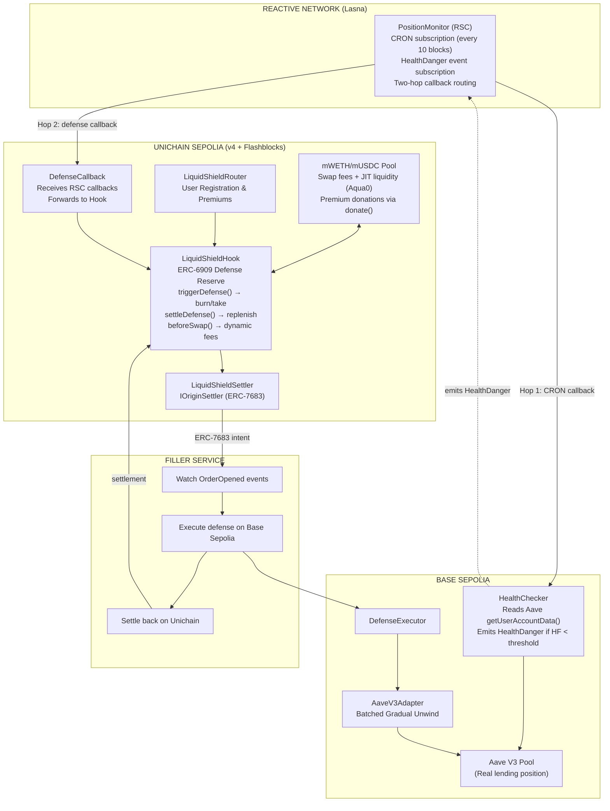
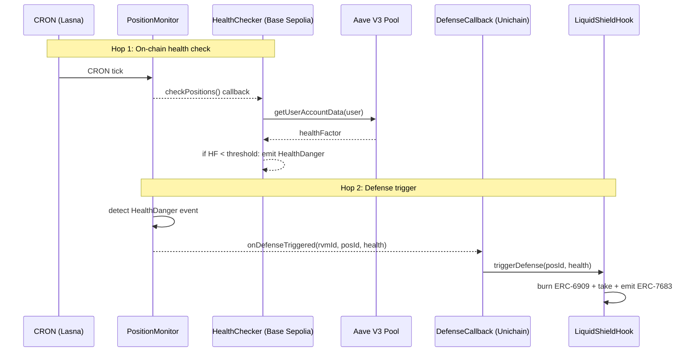

# LiquidShield — Cross-Chain Liquidation Defense Hook

> **Uniswap v4 Hook | Unichain | Reactive Network**
> **UHI8 Hookathon | March 2026**

> [!IMPORTANT]
> **[Watch the Demo Video](LOOM_LINK_HERE)** (under 5 minutes)

**Never get liquidated again.** LiquidShield is a Uniswap v4 hook that monitors DeFi lending positions across chains and executes preemptive defense strategies before liquidation occurs — turning Uniswap LPs into decentralized insurance providers.

---

## Key Features

- **Cross-Chain Defense**: Monitors Aave V3 positions on Base Sepolia via Reactive Network, triggers defense from Unichain
- **v4-Native Architecture**: ERC-6909 defense reserve with atomic burn/take/donate — every delta resolves to zero
- **Two-Hop RSC Architecture**: CRON → HealthChecker reads Aave health on-chain → HealthDanger event → RSC → DefenseCallback on Unichain
- **Extensible Adapter Pattern**: `AaveV3Adapter` (batched gradual unwind) deployed + `MorphoBlueAdapter` included with tests — protocol-agnostic
- **Sub-Second Reaction**: Flashblocks (200ms preconfirmation) + TEE priority ordering = ~400ms detection-to-defense
- **Non-Custodial**: Approval-based delegation lets the executor act on behalf of user's EOA without custody (EIP-7702 production target)
- **Novel LP Yield**: "Liquidation insurance yield" = swap fees + protection premiums + defense execution fees

---

## The Problem

Over **$2B** in DeFi positions were liquidated in 2024. Users lost 5-15% in penalties to liquidation bots and MEV searchers. Current solutions are manual — watch your health factor, set price alerts, scramble to add collateral.

No automated, non-custodial defense layer exists that works across chains.

**LiquidShield changes this.** By embedding liquidation defense directly into a Uniswap v4 hook, we turn passive LP liquidity into active insurance infrastructure.

---

## Architecture Overview



---

## Package Structure

| Package | Purpose | Technology |
|---|---|---|
| [`packages/contracts`](./packages/contracts/) | Core hook, router, settler, adapters, RSC, executor | Solidity, Foundry, Uniswap v4 |
| [`packages/filler`](./packages/filler/) | Intent watching + cross-chain execution + settlement | TypeScript, Viem, ERC-7683 |
| [`packages/frontend`](./packages/frontend/) | Dashboard + landing page | Next.js 14, wagmi v2, TailwindCSS |
| [`packages/backend`](./packages/backend/) | Position aggregation, health monitoring, defense history | Hono, TypeScript, GraphQL |
| [`packages/shared`](./packages/shared/) | Types, constants, ABIs shared across packages | TypeScript |

---

## How It Works

### Phase 1: Pool Setup & LP Deposit

LPs deposit USDC and WETH into a standard Uniswap v4 pool on Unichain with the LiquidShield hook attached. They earn triple yield: swap fees + protection premiums + defense execution fees.

### Phase 2: Position Registration

Users register their lending positions (Aave or Morpho) by calling `registerAndPayPremium()` on the router. They pre-approve the DefenseExecutor to act on their behalf on the source chain. An upfront premium (paid in USDC) covers N months of protection.

### Phase 3: Cross-Chain Monitoring

A Reactive Smart Contract (RSC) on Reactive Network's Lasna testnet periodically triggers a HealthChecker on Base Sepolia via CRON callbacks. The HealthChecker reads the user's health factor directly from Aave V3 on-chain. When health drops below the configured threshold, it emits a `HealthDanger` event. The RSC detects this and triggers a defense callback to Unichain.

### Phase 4: Defense Execution

1. RSC's Hop 2 callback hits `DefenseCallback` on Unichain (first param is `address` for RVM ID overwrite)
2. `DefenseCallback` forwards to `hook.triggerDefense(positionId, currentHealth)`
3. Hook calls `poolManager.unlock()` — enters flash accounting context
4. Inside callback: `burn()` ERC-6909 claims (+delta) → `take()` tokens (-delta) → **deltas = 0** ✓
5. Hook calls Settler to emit `ERC-7683 GaslessCrossChainOrder` with extracted defense capital
6. Filler watcher detects `OrderOpened` event on Settler, decodes intent parameters
7. Filler executor calls `DefenseExecutor.executeDefense()` on Base Sepolia with strategy=1 (batched unwind)
8. `AaveV3Adapter` executes the unwind strategy on Aave V3
9. Filler settles back on Unichain via `Settler.settle()` → hook reserve replenished, 1.5% fee charged

### Phase 5: LP Rewards

Hook periodically calls `poolManager.donate()` to distribute accumulated premiums and defense fees to in-range LPs — v4's native mechanism for LP reward distribution.

---

## Shared Liquidity Layer (Aqua0)

LiquidShield's hook inherits from `Aqua0BaseHook` — a shared liquidity layer we built that enables JIT (Just-In-Time) liquidity amplification. The hook operates two independent capital systems on the same pool: a **defense reserve** (ERC-6909 claims, funded by premiums and direct deposits) for liquidation protection, and **JIT shared liquidity** (from Aqua0's SharedLiquidityPool) for swap amplification. LPs earn yield from both systems.

| File | Description |
|---|---|
| [`packages/contracts/src/aqua0/Aqua0BaseHook.sol`](./packages/contracts/src/aqua0/Aqua0BaseHook.sol) | Base hook — `_addVirtualLiquidity()` in beforeSwap, `_removeVirtualLiquidity()` + `_settleVirtualLiquidityDeltas()` in afterSwap |
| [`packages/contracts/src/aqua0/SharedLiquidityPool.sol`](./packages/contracts/src/aqua0/SharedLiquidityPool.sol) | Shared capital pool — holds user deposits, tracks per-user PnL with exact fee isolation, settles swap deltas |

---

## Defense Strategy

The demo uses **Batched Gradual Unwind** via the `AaveV3Adapter` on Base Sepolia:

| Strategy | Adapter | Chain | How It Works |
|---|---|---|---|
| **Batched Gradual Unwind** | `AaveV3Adapter` | Base Sepolia | Hook extracts mWETH from ERC-6909 defense reserve → emits ERC-7683 intent → filler executes batched unwind on Aave V3 → position progressively unwound without cascade liquidation |

> The architecture supports multiple strategies via the `ILendingAdapter` interface. `MorphoBlueAdapter` is included with 8 unit tests but is not deployed (no Morpho markets on supported testnets).

---

## Integration Map

> Maps each technology to the exact files where it's used.

### Uniswap v4 + Unichain

Core hook deployed on Unichain Sepolia — leverages v4's flash accounting, ERC-6909 claims, `donate()`, and defense-aware dynamic fees. Unichain's 200ms Flashblock preconfirmations enable ~400ms detection-to-defense, while TEE priority ordering prevents MEV front-running. ERC-7683 cross-chain intents coordinate defense execution across chains.

| File | Description |
|---|---|
| [`packages/contracts/src/hooks/LiquidShieldHook.sol`](./packages/contracts/src/hooks/LiquidShieldHook.sol) | Main hook — `getHookPermissions()`, `beforeSwap()` (dynamic fees), `afterAddLiquidity()`, `afterRemoveLiquidity()`, defense trigger with ERC-6909 burn/take, `donate()` for LP rewards |
| [`packages/contracts/src/router/LiquidShieldRouter.sol`](./packages/contracts/src/router/LiquidShieldRouter.sol) | User-facing registration and premium payments |
| [`packages/contracts/src/settler/LiquidShieldSettler.sol`](./packages/contracts/src/settler/LiquidShieldSettler.sol) | `IOriginSettler` (ERC-7683) — `open()` emits `GaslessCrossChainOrder`, `settle()` verifies filler execution |
| [`packages/filler/src/watcher.ts`](./packages/filler/src/watcher.ts) | Monitors Flashblock-preconfirmed `OrderOpened` events, decodes intent data |
| [`packages/filler/src/executor.ts`](./packages/filler/src/executor.ts) | Filler executor — dispatches to strategy, fills on source chain |
| [`packages/filler/src/settlement.ts`](./packages/filler/src/settlement.ts) | Settlement back on Unichain after source-chain defense execution |
| [`packages/contracts/test/LiquidShieldHook.t.sol`](./packages/contracts/test/LiquidShieldHook.t.sol) | 50 tests: registration, premium collection, defense trigger, ERC-6909, donate(), dynamic fees |
| [`packages/contracts/test/LiquidShieldSettler.t.sol`](./packages/contracts/test/LiquidShieldSettler.t.sol) | 16 tests: order creation, nonce tracking, settlement, authorization |
| [`packages/contracts/test/integration/FullDefenseFlow.t.sol`](./packages/contracts/test/integration/FullDefenseFlow.t.sol) | End-to-end: register → trigger → defend → settle → donate |

### Reactive Network

Cross-chain health factor monitoring via Reactive Smart Contracts — two-hop architecture with on-chain health validation.

| File | Description |
|---|---|
| [`packages/contracts/src/rsc/PositionMonitor.sol`](./packages/contracts/src/rsc/PositionMonitor.sol) | RSC on Reactive Lasna — CRON-triggered, subscribes to HealthDanger events. Pure event router (no position storage). |
| [`packages/contracts/src/rsc/HealthChecker.sol`](./packages/contracts/src/rsc/HealthChecker.sol) | On-chain health validator on Base Sepolia — reads `getUserAccountData()` from Aave, emits `HealthDanger` if HF < threshold |
| [`packages/contracts/src/rsc/DefenseCallback.sol`](./packages/contracts/src/rsc/DefenseCallback.sol) | Callback receiver on Unichain — inherits `AbstractCallback`, first param is `address` (RVM ID overwrite), forwards `triggerDefense()` to hook |
| [`packages/contracts/test/PositionMonitor.t.sol`](./packages/contracts/test/PositionMonitor.t.sol) | 14 tests: CRON callback, HealthDanger forwarding, event filtering, access control |



### Defense Executor & Lending Adapters

| File | Description |
|---|---|
| [`packages/contracts/src/executor/DefenseExecutor.sol`](./packages/contracts/src/executor/DefenseExecutor.sol) | Source-chain executor — routes to correct `ILendingAdapter`, executes defense via user's pre-approval |
| [`packages/contracts/src/interfaces/ILendingAdapter.sol`](./packages/contracts/src/interfaces/ILendingAdapter.sol) | Protocol-agnostic interface — `getHealthFactor()`, `depositCollateral()`, `repayDebt()`, `getPositionData()` |
| [`packages/contracts/src/adapters/AaveV3Adapter.sol`](./packages/contracts/src/adapters/AaveV3Adapter.sol) | Aave V3 adapter — collateral top-up via `pool.supply()`, health factor via `getUserAccountData()` |
| [`packages/contracts/src/adapters/MorphoBlueAdapter.sol`](./packages/contracts/src/adapters/MorphoBlueAdapter.sol) | Morpho Blue adapter — computed HF from position data + oracle + LLTV, `supplyCollateral()` for defense |
| [`packages/contracts/test/adapters/`](./packages/contracts/test/adapters/) | Per-adapter test suites (9 Aave tests, 8 Morpho tests including fuzz) |

---

## Supported Networks

| Network | Chain ID | Role |
|---|---|---|
| **Unichain Sepolia** | 1301 | Hook deployment, pool, settlement |
| **Base Sepolia** | 84532 | Aave V3 positions + defense execution (source chain) |
| **Reactive Lasna** | 5318007 | RSC deployment for cross-chain monitoring |

> **Note:** MorphoBlueAdapter is included with 8 unit tests but is not deployed to a testnet — no Morpho Blue markets exist on supported Reactive Network testnets. Arbitrum Sepolia has executor + adapter deployed but is not monitored by the RSC (not supported by Reactive Network as origin chain).

---

## Deployed Contracts

> Testnet deployments for the hookathon demo.

| Contract | Network | Address |
|---|---|---|
| `LiquidShieldHook` | Unichain Sepolia | `0x0AA6345204931FE6E5748BdB0A17C8DfeD25d5c0` |
| `LiquidShieldRouter` | Unichain Sepolia | `0xa81344a8A6320Fc75095aF160CaCe5B47530E444` |
| `LiquidShieldSettler` | Unichain Sepolia | `0xdC2E7C04c7E742d3e116aC2ce787B59C75a1523e` |
| `DefenseCallback` | Unichain Sepolia | `0xa83E9240221e66f58665fef54F653f0a89E70B75` |
| `HealthChecker` | Base Sepolia | `0x7D3692dd5B58f9B35fF5EcaAEc33b80CBB490038` |
| `DefenseExecutor` | Base Sepolia | `0x4459b385544c752922940ba87e86c6DbA8f4CDEF` |
| `AaveV3Adapter` | Base Sepolia | `0x560010aEA084A62B3e666f7e48A190A299049129` |
| `PositionMonitor` (RSC) | Reactive Lasna | `0x92CD07dD3F91F00242Be400a54184830aeDfb464` |

> **Demo scope:** The system actively monitors real Aave V3 positions on Base Sepolia (WETH collateral, USDC debt). The RSC's CRON triggers the HealthChecker every ~10 blocks, which reads the health factor on-chain from Aave. When HF < 1.5, the HealthDanger event triggers defense on Unichain — ERC-6909 extraction, ERC-7683 intent emission via batched unwind strategy.

### Verified Transactions (End-to-End Proof)

> These transactions demonstrate the full cross-chain defense flow working on live testnets.

| Step | Description | Network | Transaction |
|---|---|---|---|
| **RSC Deploy** | PositionMonitor deployed with CRON + HealthDanger subscriptions | Reactive Lasna | [`0xaba3f725...`](https://lasna.reactscan.net/tx/0xaba3f725942bcd2363c15a7912ae7af63fa2ced7c0a7dc3a8374df6e254f6871) |
| **CRON react()** | RSC fires on CRON tick → emits Callback to HealthChecker on Base Sepolia | Reactive Lasna | [`0x1d4d22ff...`](https://lasna.reactscan.net/tx/0x1d4d22ff18ce5687e3fea5eb0353da8fcaba98db1b707398115cbc32c9d8ff97) |
| **Hop 1 Callback** | HealthChecker reads Aave on-chain → emits HealthDanger for 4 positions | Base Sepolia | [`0xba19cc06...`](https://sepolia.basescan.org/tx/0xba19cc068fb800138841703bc45e2f495121a6499b450bed6566f1c7e3a960f9) |
| **HealthDanger react()** | RSC detects HealthDanger events → emits Callbacks to Unichain | Reactive Lasna | [`0xe720f1b5...`](https://lasna.reactscan.net/tx/0xe720f1b5d387311a3a709b66f1c7a4e9ff195dd1f2c86c698aecfa56140e6322) |
| **Hop 2 Callback** | Callback proxy → DefenseCallback → hook.triggerDefense() | Unichain Sepolia | [`0x77c446e4...`](https://sepolia.uniscan.xyz/tx/0x77c446e449af2ef669a18c6254e31f8637bce7d7a43e6f1b065d720d5deb7e2a) |
| **Defense Triggered** | Hook burns ERC-6909 claims, takes tokens, emits ERC-7683 intent via Settler | Unichain Sepolia | [`0xf1731ec4...`](https://sepolia.uniscan.xyz/tx/0xf1731ec4dcc100a428695237a503e1a85df3d06274d7bfe52c7ecec9a8ff1e33) |
| **Filler Execution** | Filler calls DefenseExecutor → AaveV3Adapter supplies WETH to Aave V3 | Base Sepolia | [`0x569338d2...`](https://sepolia.basescan.org/tx/0x569338d268eabbd5a64e6d3adb18282f73c673f87c940c698a5ded50e87d11dd) |
| **Order Settlement** | Filler settles ERC-7683 order on Settler (marks order complete) | Unichain Sepolia | [`0xad944a50...`](https://sepolia.uniscan.xyz/tx/0xad944a506a8fae211ecfc4f5dadc393644f1aca6c0f2a30ac48d8e95c8f931cc) |
| **Defense Settled** | Hook settleDefense() → reserve replenished, 1.5% fee charged, position → ACTIVE | Unichain Sepolia | [`0x55493273...`](https://sepolia.uniscan.xyz/tx/0x55493273aebb6181b1fb0380c702945ef7bdaebf1d61de8cbd754f3c1a419b6c) |

> **RSC proof of liveness:** [13,000+ RVM transactions on Reactscan](https://lasna.reactscan.net/address/0x40ba13eaa42d52915e79ddb7a980707fd70d945f?screen=rvm_transactions) show the PositionMonitor RSC continuously firing CRON callbacks and HealthDanger responses. Callback arrivals are independently verifiable on the destination chains: [HealthChecker on Basescan](https://sepolia.basescan.org/address/0x7D3692dd5B58f9B35fF5EcaAEc33b80CBB490038) (Hop 1) and [DefenseCallback on Uniscan](https://sepolia.uniscan.xyz/address/0xa83E9240221e66f58665fef54F653f0a89E70B75) (Hop 2).

---

## Quick Start

### Prerequisites

- [Foundry](https://book.getfoundry.sh/) (for contracts)
- Node.js 18+ and pnpm 8+
- Access to testnet faucets ([Unichain](https://faucet.unichain.org/), [Alchemy Sepolia](https://sepoliafaucet.com/))

### Installation

```bash
git clone https://github.com/0xYudhishthra/liquidshield.git
cd liquidshield

# Install contract dependencies
cd packages/contracts
forge install

# Install JS dependencies
cd ../..
pnpm install
```

### Run Tests

```bash
# Contract tests (150 tests)
cd packages/contracts
forge test -vvv

# Specific adapter tests
forge test --match-contract AaveV3AdapterTest -vvv
forge test --match-contract MorphoBlueAdapterTest -vvv

# Backend tests (285 tests)
cd ../backend && pnpm test

# Frontend tests (129 tests)
cd ../frontend && pnpm test

# Filler tests (23 tests)
cd ../filler && pnpm test
```

### Local Development

```bash
# Start backend API
cd packages/backend && pnpm dev

# Start frontend
cd packages/frontend && pnpm dev

# Start filler service
cd packages/filler && pnpm dev
```

### Environment Configuration

Copy `.env.example` to `.env` and fill in your values:

```bash
# RPC Endpoints
UNICHAIN_SEPOLIA_RPC_URL=https://sepolia.unichain.org
ARBITRUM_SEPOLIA_RPC_URL=https://sepolia-rollup.arbitrum.io/rpc
ETHEREUM_SEPOLIA_RPC_URL=https://rpc.sepolia.org
REACTIVE_LASNA_RPC_URL=https://lasna-rpc.rnk.dev

# Deployer
PRIVATE_KEY=0x...

# Frontend
NEXT_PUBLIC_HOOK_ADDRESS=
NEXT_PUBLIC_ROUTER_ADDRESS=
NEXT_PUBLIC_SETTLER_ADDRESS=
NEXT_PUBLIC_API_URL=http://localhost:3001

# Filler
FILLER_PRIVATE_KEY=0x...
```

### Demo Scripts

Scripts for reproducing the full defense flow end-to-end:

```bash
# 1. Swap through the hook (demonstrates JIT liquidity from Aqua0)
PRIVATE_KEY=0x... ./script/demo-swap-jit.sh

# 2. Drop health factor by borrowing more on Aave (Base Sepolia)
PRIVATE_KEY=0x... ./script/demo-simulate-health-drop.sh

# 3. Watch for defense trigger (polls hook status every 10s)
./script/demo-watch-defense.sh <positionId> [userAddress]

# 4. Run the filler service to execute defense + settle
PRIVATE_KEY=0x... ./script/demo-run-filler.sh
```

---

## Testing

```bash
cd packages/contracts

# Full suite
forge test

# With gas reporting
forge test --gas-report

# Specific test files
forge test --match-contract LiquidShieldHookTest     # Core hook (50 tests)
forge test --match-contract PositionMonitorTest       # RSC monitoring (19 tests)
forge test --match-contract LiquidShieldSettlerTest   # ERC-7683 settlement (16 tests)
forge test --match-contract DefenseExecutorTest       # Source-chain executor (10 tests)
forge test --match-contract AaveV3AdapterTest         # Aave adapter (9 tests)
forge test --match-contract MorphoBlueAdapterTest     # Morpho adapter (8 tests)
forge test --match-contract LiquidShieldRouterTest    # Router (7 tests)
forge test --match-contract FullDefenseFlowTest       # End-to-end integration (7 tests)
```

### Test Coverage

| Test Suite | Tests | Description |
|---|---|---|
| `LiquidShieldHook.t.sol` | 52 | Registration, premium collection, defense trigger, ERC-6909 accounting, donate(), dynamic fees, Aqua0 JIT, fuzz testing |
| `ProtectionMechanism.t.sol` | 27 | Delta atomicity, dynamic fee scaling, reserve depletion, premium boundaries, multi-user concurrent defenses, full E2E, fuzz |
| `LiquidShieldSettler.t.sol` | 16 | Order creation, nonce tracking, settlement verification, authorization, fuzz testing |
| `PositionMonitor.t.sol` | 14 | RSC subscription with AbstractReactive, react(LogRecord), vmOnly, callback emission |
| `DefenseExecutor.t.sol` | 10 | Strategy dispatch, adapter routing, access control, fuzz testing |
| `AaveV3Adapter.t.sol` | 9 | Health factor reads, collateral deposit, debt repay, fuzz testing |
| `MorphoBlueAdapter.t.sol` | 8 | HF computation from position data + oracle + LLTV, collateral operations |
| `LiquidShieldRouter.t.sol` | 7 | User registration, premium payments, unregistration |
| `FullDefenseFlow.t.sol` | 7 | Full lifecycle: register → trigger → defend → settle → donate → unregister |
| **Total Solidity** | **150** | |
| Backend tests | 285 | API routes, position aggregation, defense store, webhooks |
| Frontend tests | 129 | Component tests, hook tests, utility tests |
| Filler tests | 23 | Watcher, executor, strategy tests |
| **Total** | **563** | |

---

## Technical Decisions

**Why ERC-6909 defense reserve, not "draw from pool"?**
v4's flash accounting requires all deltas to resolve to zero within a single `unlock` callback. The hook can't `take()` tokens and send them cross-chain expecting repayment later — the transaction would revert. Instead, the hook accumulates defense capital as ERC-6909 claims (from premium revenue) and atomically burns/takes when defense triggers.

**Why `poolManager.donate()` for LP premiums?**
It's v4's native mechanism for distributing tokens to in-range LPs. No custom accounting needed. Premiums collected by the hook are periodically donated to the pool, flowing to LPs proportional to their liquidity.

**Why batched intents, not TWAMM, for gradual unwind?**
TWAMM is a pool-side swap mechanism. Defense unwind is a cross-chain operation (withdraw collateral → sell → repay). Each step requires a full ERC-7683 settlement cycle. The hook emits N sequential intents — Unichain-side accounting updates at Flashblock speed, but source chain execution is bound by its block time.

**Why USDC/WETH pool?**
Both assets serve as defense capital — WETH for WETH-collateralized positions, USDC for USDC-collateralized positions. No swap needed to deploy defense capital, reducing slippage and latency.

---

## License

This project is licensed under the [MIT License](./LICENSE).

## Links

- **Demo Video**: [Loom](LOOM_LINK_HERE)
- **Hookathon**: [UHI8 by Atrium Academy](https://atrium.academy/uniswap)
- **Uniswap v4 Docs**: [docs.uniswap.org](https://docs.uniswap.org/contracts/v4/overview)
- **Unichain Docs**: [docs.unichain.org](https://docs.unichain.org)
- **Reactive Network**: [reactive.network](https://reactive.network)

---

**Built for the UHI8 Hookathon by [Yudhishthra](https://github.com/0xYudhishthra)**

*Turning passive liquidity into active insurance infrastructure.*
